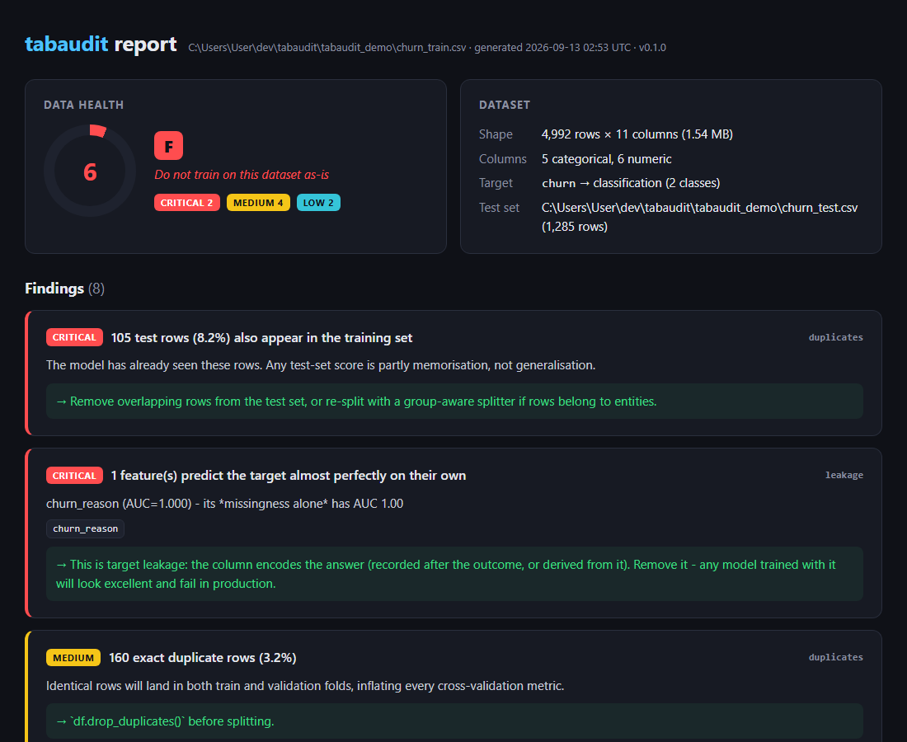

# tabaudit

**Find the problems in your dataset before your model does.**

`tabaudit` is a command-line tool that audits a tabular ML dataset for the defects that
quietly inflate metrics and break models in production — target leakage, train/test
contamination, duplicates, label noise, class imbalance and schema problems — and gives it
a single **Data Health Score** with concrete, prioritised fixes.

```
pip install tabaudit
tabaudit audit train.csv --target churn --test test.csv --html report.html
```



---

## Why

A model that scores 99% on a leaked dataset is worse than useless: it looks finished and
fails silently in production. Most of these defects take one line of pandas to fix — the
hard part is *noticing* them. `tabaudit` makes the check automatic, fast, and repeatable
(it runs in CI with `--fail-under`).

## What it checks

| check         | finds                                                                                                     | severity |
| ------------- | --------------------------------------------------------------------------------------------------------- | -------- |
| `leakage`     | single features that predict the target almost perfectly on their own (incl. *missingness* leaks), identifier columns, columns named after the target | CRITICAL / HIGH / MEDIUM |
| `duplicates`  | exact duplicate rows, feature-identical rows with conflicting labels, **test rows that also appear in train** | CRITICAL → LOW |
| `label_noise` | probably-mislabeled rows via confident learning ([cleanlab](https://github.com/cleanlab/cleanlab)), ranked and tiered | HIGH → INFO |
| `imbalance`   | class ratio, classes with < 10 examples                                                                   | HIGH → LOW |
| `schema`      | ≥ 50 % missing columns, missing labels, constant / near-constant columns, numbers stored as text, leftover index columns | HIGH → INFO |

Every finding carries a plain-English explanation of *why it matters* and *what to do*.
Findings are weighted into a 0–100 score and an A–F grade.

## Quick start

```bash
pip install tabaudit

# See every check fire on a synthetic dataset with planted defects
tabaudit demo

# Audit your own data
tabaudit audit data.csv --target label
tabaudit audit train.parquet -t label --test test.parquet --html report.html --json report.json

# Only some checks, sampled for speed, gate a CI pipeline
tabaudit audit data.csv -t label -c leakage,duplicates --max-rows 20000 --fail-under 75
```

Supported inputs: CSV, TSV, Parquet, Feather, JSON-lines. Classification and regression
targets are inferred automatically; omit `--target` to run only the unsupervised checks.

### Python API

```python
from tabaudit import run_audit

report = run_audit("train.csv", target="churn", test="test.csv")
print(report.score, report.grade)          # 6 'F'
for f in report.sorted_findings():
    print(f.severity.value, f.title, f.columns)
report.to_dict()                            # JSON-serialisable
```

## Example output

```
┌────────────────────────────────── Verdict ──────────────────────────────────┐
│  Data Health Score  6/100   F                                               │
│  ██░░░░░░░░░░░░░░░░░░░░░░░░░░░░                                             │
│  Do not train on this dataset as-is                                         │
│   CRITICAL  2    MEDIUM  4    LOW  2                                        │
└─────────────────────────────────────────────────────────────────────────────┘
┌─  CRITICAL   105 test rows (8.2%) also appear in the training set ──────────┐
│  The model has already seen these rows. Any test-set score is partly        │
│  memorisation, not generalisation.                                          │
│  → Remove overlapping rows from the test set, or re-split with a            │
│  group-aware splitter if rows belong to entities.                           │
└──────────────────────────────────────────────────────────────── duplicates ─┘
┌─  CRITICAL   1 feature(s) predict the target almost perfectly on their own ─┐
│  churn_reason (AUC=1.000) - its *missingness alone* has AUC 1.00            │
│  → This is target leakage: the column encodes the answer (recorded after    │
│  the outcome, or derived from it). Remove it - any model trained with it    │
│  will look excellent and fail in production.                                │
└─────────────────────────────────────────────────────────────────── leakage ─┘
```

## How the hard checks work

**Leakage.** For each feature *alone*, a shallow decision tree is cross-validated against
the target. A single column with out-of-fold AUC ≥ 0.98 (or R² ≥ 0.98 for regression) is
almost never a legitimate signal — it is the answer written down after the fact. Below
that, a leak has to be an *outlier*: the sorted single-feature scores are split at their
largest gap, and only a feature that sits ≥ 0.15 above every other one is flagged (HIGH if
it scores ≥ 0.90, MEDIUM "soft leak" if ≥ 0.75). Several strong features bunched together
mean the task is easy, not leaky — that case is reported at INFO. Missing values are
encoded so the tree can split on *missingness itself*, which catches the common "this field
is only filled in for positives" leak.

**Label noise.** An out-of-fold gradient-boosting model produces class probabilities for
every row; cleanlab's confident-learning filter flags rows whose given label it confidently
contradicts. The model is deliberately regularised because an over-confident model makes
cleanlab over-flag. Leaky and identifier columns found by the `leakage` check are excluded
first — otherwise the leak makes the model agree with every wrong label and the noise is
invisible.

Suspects are reported in two tiers: **likely** (model gives the given label < 20 %
probability) and **suspected** (any confident-learning flag), ranked most-confident first.

### Measured on known ground truth

The demo generator knows exactly which labels it flipped, so the detector can be scored
honestly (`python examples/validate_label_noise.py <noise_rate>`; 6 000 rows, clean-data
AUC ≈ 0.88):

| planted noise | flipped rows | "likely" flagged | likely precision / recall | top-25 precision |
| ------------- | ------------ | ---------------- | ------------------------- | ---------------- |
| 2.2 %         | 110          | 187              | 32 % / 55 %               | 56 %             |
| 6.4 %         | 317          | 313              | 60 % / 59 %               | 72 %             |
| 10.3 %        | 514          | 420              | 73 % / 60 %               | 72 %             |

Random label flips on rows the model is genuinely unsure about are indistinguishable from
correct labels, so no detector can reach high precision *and* recall here. The point is
the ranked review list, not the raw count — and the count is a useful estimate at realistic
noise rates.

## Development

```bash
git clone https://github.com/sadiasamia121912/tabaudit && cd tabaudit
python -m venv .venv && .venv/Scripts/activate      # or source .venv/bin/activate
pip install -e ".[dev]"
pytest
ruff check src tests examples && ruff format --check src tests examples
```

Adding a check: drop a module in `src/tabaudit/checks/` exposing
`run(ctx: AuditContext) -> list[Finding]` and register it in `checks/__init__.py`.
Checks run in registry order and may communicate through `ctx.excluded_features`.

## Roadmap

- [ ] Group / time leakage: entity IDs shared across splits, features that peek into the future
- [ ] Near-duplicate detection (fuzzy text, numeric tolerance)
- [ ] Label-noise support for regression targets
- [ ] Audit results for popular public benchmark datasets
- [ ] `pre-commit` hook and GitHub Action

## License

MIT
